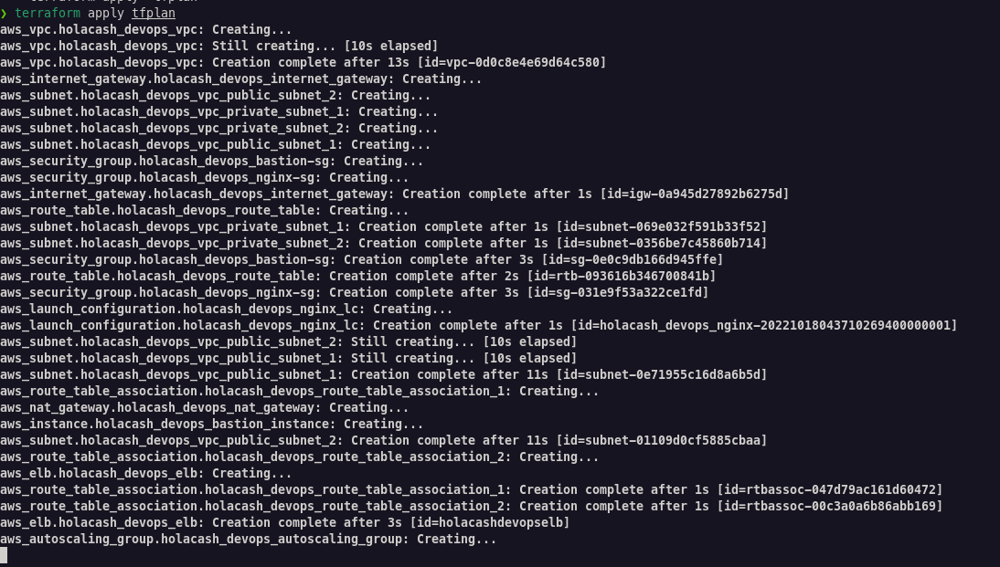

# holacash_devops_challenge
by Ronney Alberto Espinosa Hernández
ronneyalb@gmail.com

To test this code follow these steps

### 1) Create the env file with the following variables in tf directory:

```
export AWS_ACCESS_KEY_ID="<<KEY_ID>>"
export AWS_SECRET_ACCESS_KEY="<<ACCESS_KEY>>"
export AWS_DEFAULT_REGION="us-east-1"
```

### 2) execute the initialization command
```
terraform init
```
### 3) execute the plan command

```
terraform plan -out=tfplan
```

### 4) execute the apply command

```
terraform appy tfplan
```

### 4) wait for the result and validate the execution

### Done!

## Below screenshots of the execution


********

********

********

********

********

********

